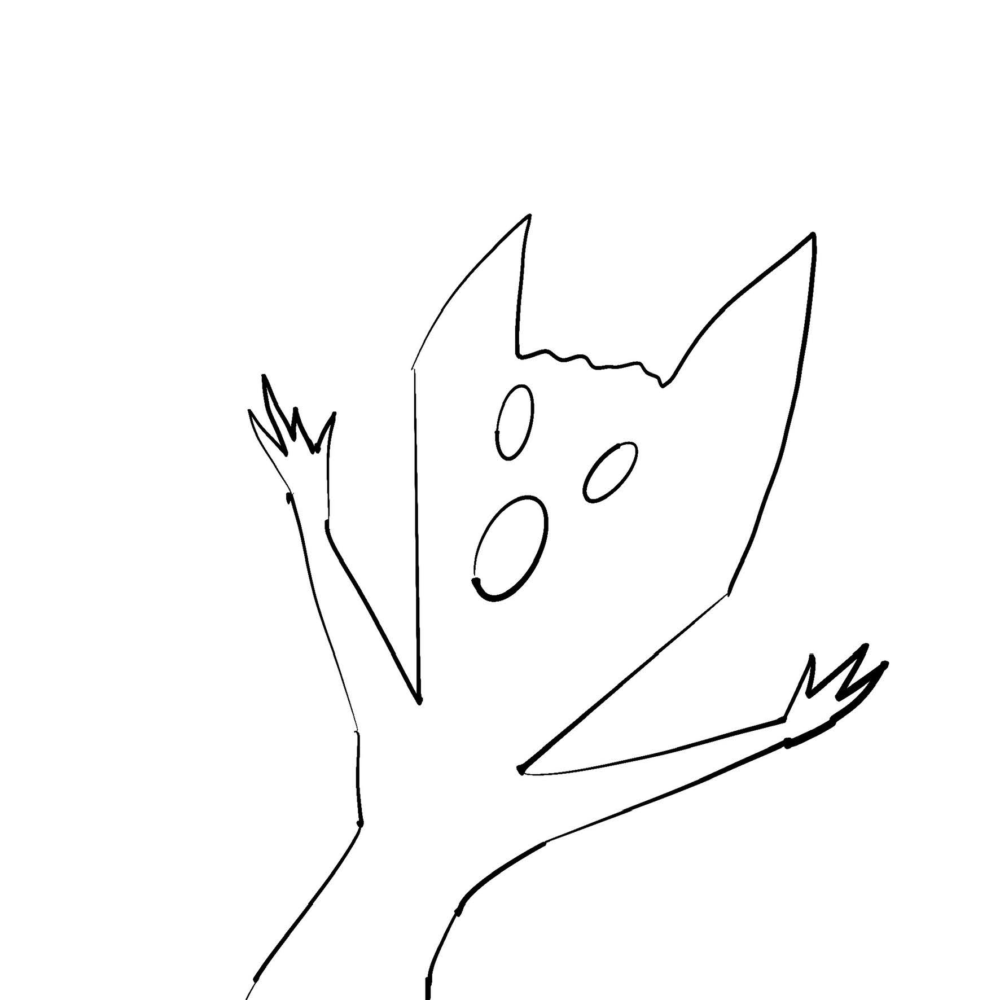
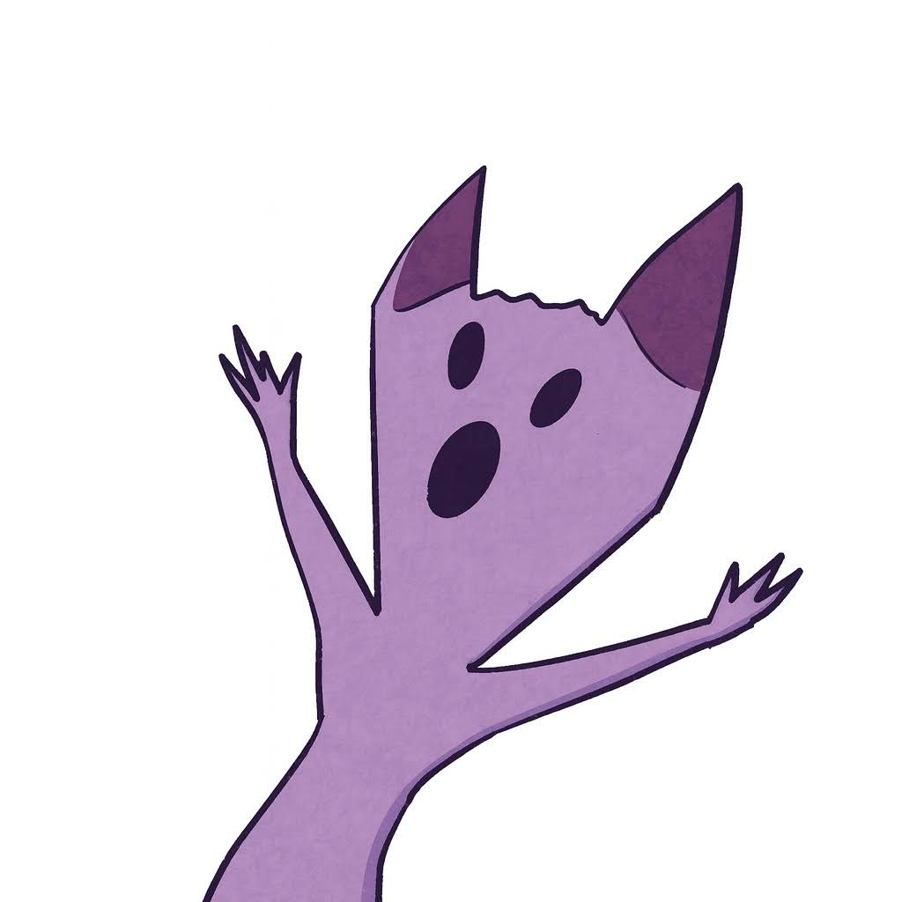
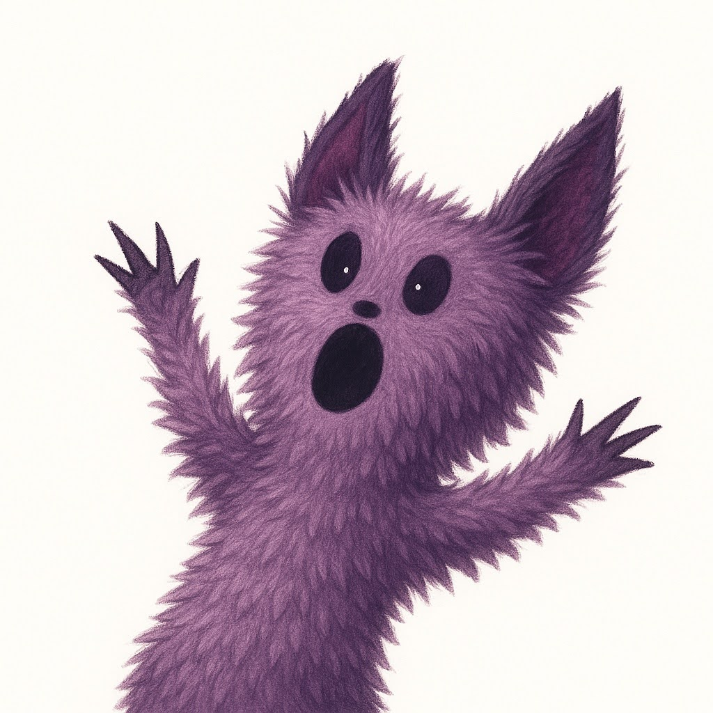
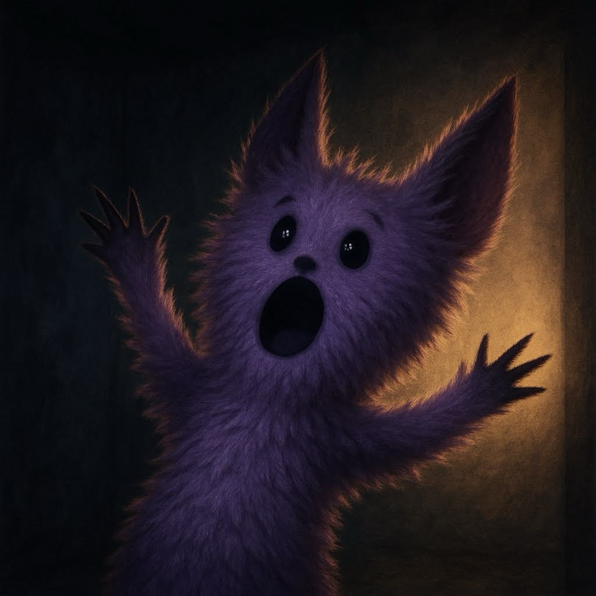

I decided to experiment a bit and doodled this goofy little monster:

Then I asked ChatGPT to complete the drawing.

The result? A colored version with all the original lines preserved. Pretty cool already! It even added a few extra details. For this kind of output in Stable Diffusion, you'd probably need extra tools like ControlNet.

I took it a step further and asked to make the monster fluffy — and voilà:

It turned out to be a pretty solid character! So I decided to play with lighting and asked the AI to place it in a dark room.

The result blew me away — it didn't just swap the background. The lighting changed completely, and the fur edges got that subtle glow you'd expect in low light.

